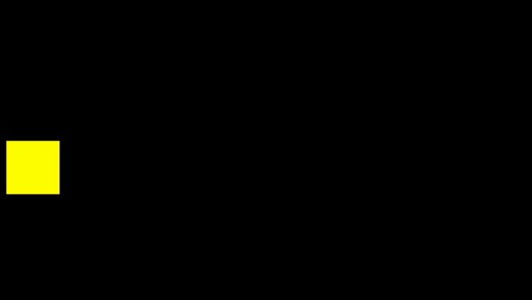

### Getting started with OpenGL

----------------------------------------------
###### Square Animation changing the square geometry on the x-axis
- Code at Square_Animation_withGeometryChanges/Source.cpp

###### Square Animation using Translation
- Code at Square_Animation_using_Translation/Source.cpp

