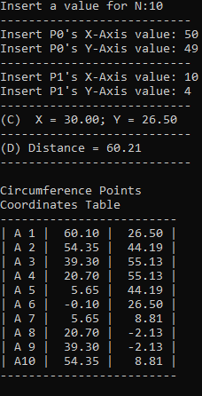

##### PL1 
===============================================================

```cpp
#define _USE_MATH_DEFINES		//M_PI
#define _CRT_SECURE_NO_WARNINGS //Disables depracation (scanf)
#include <stdio.h>
#include <math.h>
#include <stdlib.h>

typedef struct {
    double x, y;
} point;

int main(void) {
	point p0, p1, c;
	int n, i;
	double d, radius, alpha, x, y, t = 0;

	//Reads N
	printf("Insert a value for N:"); (void)scanf("%d", &n); printf("---------------------------\n");

	//Reads P0
	printf("Insert P0's X-Axis value: "); (void)scanf("%lf", &p0.x);
	printf("Insert P0's Y-Axis value: "); (void)scanf("%lf", &p0.y);

	//Reads P1
	printf("---------------------------\n");
	printf("Insert P1's X-Axis value: "); (void)scanf("%lf", &p1.x);
	printf("Insert P1's Y-Axis value: "); (void)scanf("%lf", &p1.y); printf("---------------------------\n");

	//Calculates C (Straight segment's middle point between P0 and P1)
	c.x = (p0.x + p1.x) / 2.0;
	c.y = (p0.y + p1.y) / 2.0;
	printf("(C)  X = %.2lf; Y = %.2lf", c.x, c.y); printf("\n---------------------------\n");

	//Calculates D (Distance between P0 and P1)
	d = sqrt( pow((p1.x - p0.x), 2) + pow((p1.y - p0.y), 2));
	printf("(D) Distance = %.2lf", d); printf("\n---------------------------\n");

	//Coordinates Table
	alpha = ((360 * (M_PI/180)) / n); //Alpha must be in radians to later use the COS/SEN functions
	radius = d / 2;

	printf("\nCircumference Points\nCoordinates Table\n-------------------------\n");
	for (i = 0; i < n; i++) {
		x = radius * cos(t) + c.x;
		y = radius * sin(t) + c.y;
		t += alpha;
		printf("| A%2d | %6.2lf | %6.2lf |\n", i+1, x, y);
	}
	printf("-------------------------\n\n");

	return 0;
}
```

===============================================================
##### Console Output


