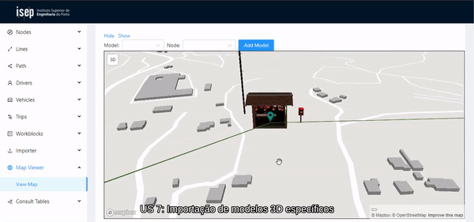
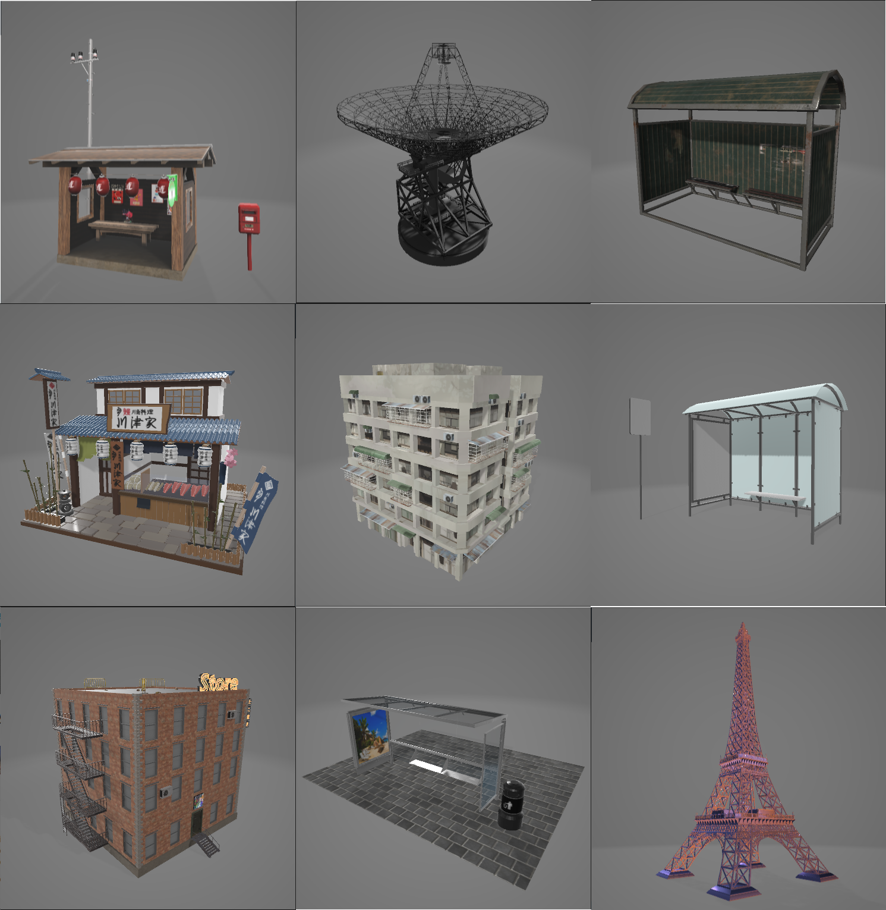
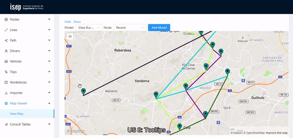
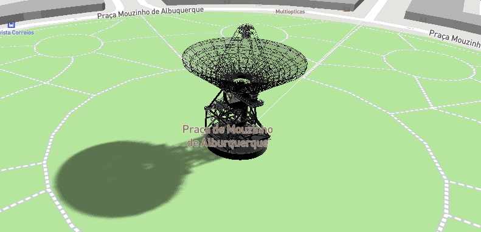

# ISEP-SGRAI-2020/2021
SGRAI unit course modules and final project.

[PL1](./PL1)

--------

# **Final Project**

 ## **Sprint 1**

 ### User Stories:
 * [**1**] Como cliente ou gestor pretendo visualizar graficamente em 2D a rede de transportes. ✔️
 * [**2**] Como cliente ou gestor pretendo controlar a visualização. Adicionar os comandos da câmara pan e zoom; o comando orbit deverá estar inactivo (sugestão: botão direito do rato – pan; roda do rato – zoom). ✔️
 * [**3**] Como cliente ou gestor pretendo ter uma representação da rede georreferenciada. Subpor a área geográfica (mapa) abrangida pela rede de transportes. ✔️

 Abaixo é possível ver num mapa **2D** a rede de transportes, nós/paragens identificadas por marcadores e respetivas linhas/percursos.
 Cada linha, à semelhança do que é visto no *Metro do Porto* tem uma cor associada, de maneira a ser possível identificar rapidamente a mesma.

 

 ----------------

  ## **Sprint 2**

 ### User Stories:
* [**4**] Como cliente ou gestor pretendo comutar o tipo de representação gráfica: 2D ou 3D. Adicionar um objecto de interacção (por exemplo, um botão) que o permita fazer. ✔️
* [**5**] Como cliente ou gestor pretendo controlar a visualização. Na representação 3D, o comando da câmara orbit deverá estar activo (sugestão: botão esquerdo do rato – orbit); na representação 2D, deverá permanecer inactivo. ✔️
* [**6**] Como cliente ou gestor pretendo visualizar modelos 3D nas estações de recolha e restantes nós. Modelar ou importar objectos 3D representativos dos nós da rede e colocá-los nas posições apropriadas da cena. Cada nó da rede terá o seu próprio modelo. ✔️
* [**7**] Como data administrator pretendo seleccionar o modelo 3D a usar num dado nó; preferencialmente importando um ficheiro com esse modelo. ✔️

Em baixo é possível ver um botão para a comutação entre **2D** e **3D** (US 4) e câmara orbit ativa no modo **3D** (US 5):

Agora é possível ver modelos **3D** no local das paragens, estes modelos são carregados no momento em que o componente do mapa é *mounted*. É feito um consumo dos dados da rede presentes na base de dados através da API responsável pelo tratamento de nós/linhas/percursos.

##### (US 6)
--------

Para a user story 7, teria de ser possível importar modelos para cada nó. Para isso, fiz download de alguns modelos 3D no formato **GLTF**, e disponibilizei-os na cloud, para maior rapidez. O componente faz consumo dos dados na cloud, apresentando as opções num *Dropdown Menu*. É possível selecionar o nó, e que modelo é pretendido importar para aquele nó.

##### (US 7)
------

Os modelos disponíveis para importação são:

 ----------------

  ## **Sprint 3 (Final)**

 ### User Stories:

 * [**8**] Como cliente ou gestor pretendo ter informação sobre os “elementos” da rede. Em ambos os modos de representação (2D e 3D), apresentar tooltips contendo informação acerca das características dos objectos (nós, linhas, percursos, etc.) apontados pelo cursor gráfico; remover os tooltips quando o cursor é afastado dos referidos objectos. ✔️
* [**9**] Como cliente ou gestor pretendo simular uma viagem pilotando uma viatura. No modo 3D, implementar a navegação na primeira pessoa (sugestão: tecla ‘A’ – rodar para a esquerda; tecla ‘D’ – rodar para a direita; tecla ‘W’ – avançar; tecla ‘S’ – recuar). ❌
* [**10**] Como cliente ou gestor pretendo aumentar o realismo da navegação na primeira pessoa. Detectar as colisões da viatura com os modelos 3D representativos dos nós da rede. ❌
* [**11**] Como cliente ou gestor pretendo aumentar o realismo da representação gráfica. No modo 3D, adicionar iluminação e projecção de sombras. ✔️
* [**12**] Como cliente ou gestor pretendo controlar a iluminação. Adicionar objectos de interacção (por exemplo, botões, sliders, etc.) que permitam configurar as condições de iluminação da cena; estes objectos deverão estar activos no modo 3D e inactivos ou invisíveis no modo 2D. ❌

##### (US 8) Tooltips nos nós e nas linhas:
------

##### (US 11) Projeção de sombras:
------
